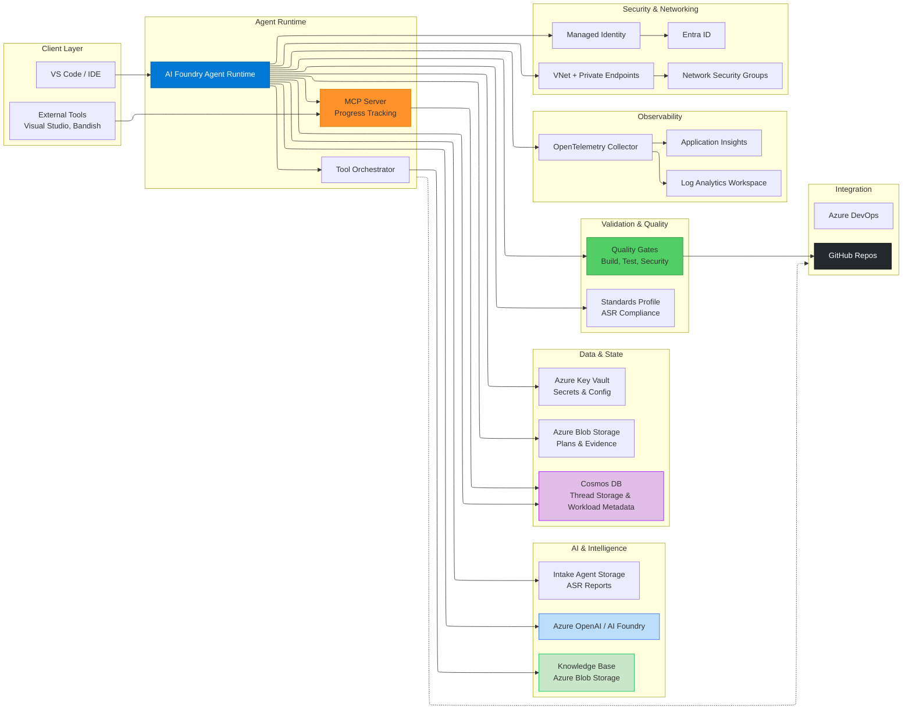
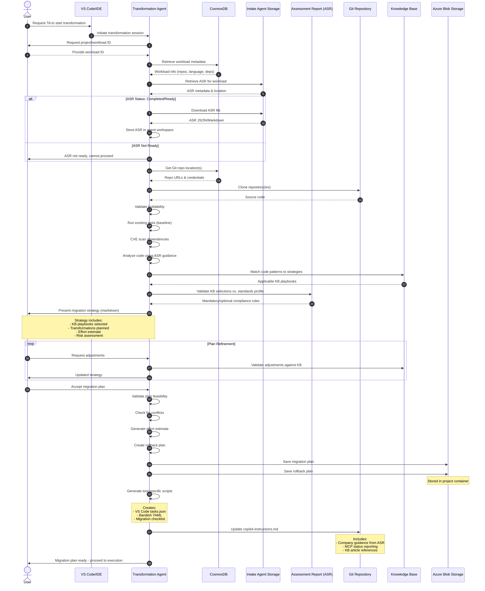
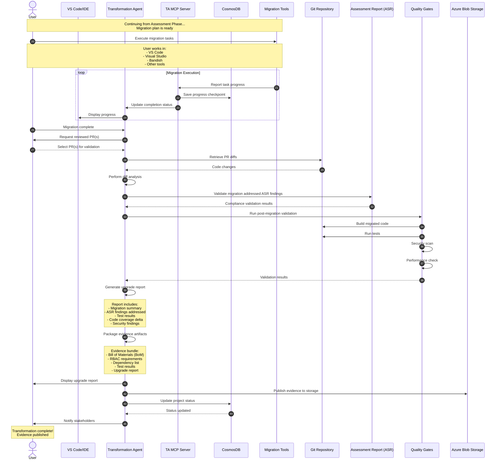
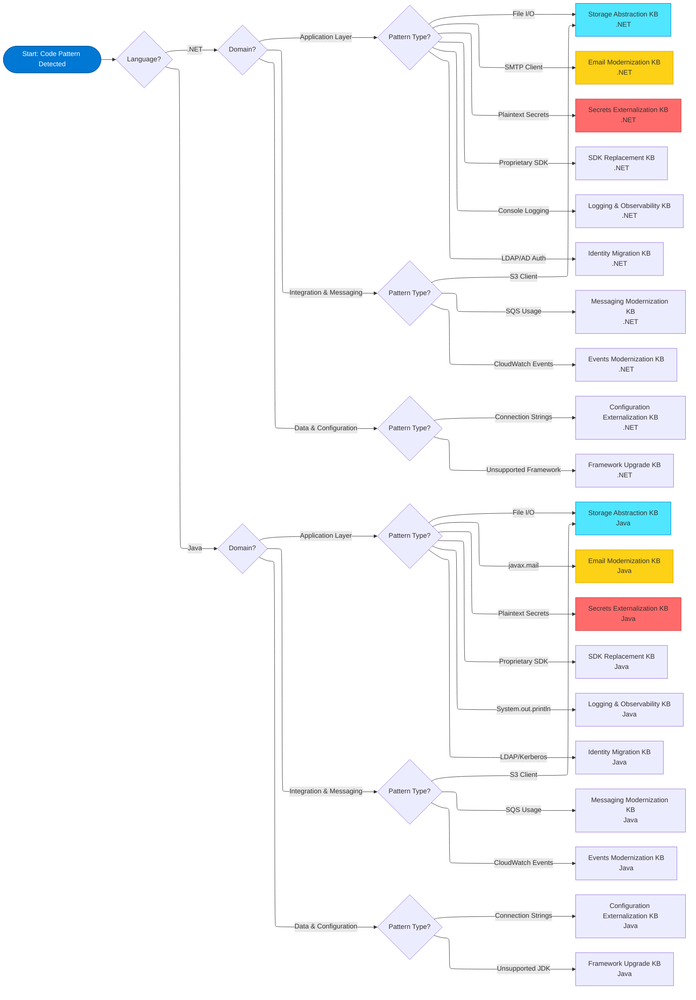
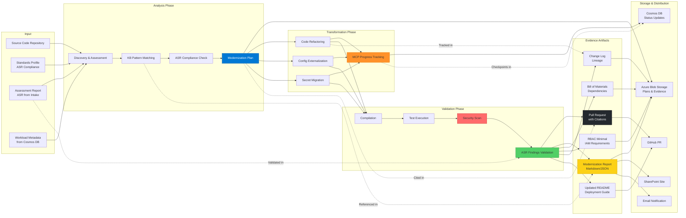
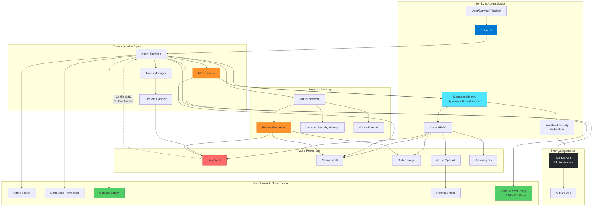

# Transformation Agent Diagram Specifications

This document provides specifications for all diagrams referenced in the Transformation Agent Design Document. Each diagram includes both Mermaid syntax (for markdown rendering) and a description for creating enhanced versions in Draw.io or other tools.

## Table of Contents

- [Transformation Agent Diagram Specifications](#transformation-agent-diagram-specifications)
  - [Table of Contents](#table-of-contents)
  - [1. High-Level Architecture Diagram](#1-high-level-architecture-diagram)
  - [2. Agent Interaction Flow \[WIP\]](#2-agent-interaction-flow-wip)
    - [2.1 Assessment \& Planning Phase](#21-assessment--planning-phase)
    - [2.2 Migration Execution \& Validation Phase](#22-migration-execution--validation-phase)
  - [3. Transformation Strategy Decision Tree \[WIP\]](#3-transformation-strategy-decision-tree-wip)
  - [4. Tool Orchestration Architecture](#4-tool-orchestration-architecture)
  - [5. Evidence \& Lineage Flow](#5-evidence--lineage-flow)
  - [6. Security \& Identity Model](#6-security--identity-model)

---

## 1. High-Level Architecture Diagram

**Purpose:** Show overall agent architecture and Azure service integration

**Design Doc Reference:** Section 3.1 - Platform Architecture

---

## 2. Agent Interaction Flow [WIP]

**Purpose:** Visualize the complete agent workflow from project intake through migration execution to evidence publication

**Design Doc Reference:** Section 3.2 - Application Architecture

### 2.1 Assessment & Planning Phase

### 2.2 Migration Execution & Validation Phase

---

## 3. Transformation Strategy Decision Tree [WIP]

**Purpose:** Help users identify which KB playbook applies to their scenario

**Design Doc Reference:** Section 6 - Transformation Strategy by Use Case

---

## 4. Tool Orchestration Architecture

**Purpose:** Show how agent orchestrates various tools and analyzers

**Design Doc Reference:** Section 4 - Functional Requirements (Tool Reuse & Orchestration)

```mermaid
graph TB
    subgraph "Transformation Agent Core"
        Orchestrator[Tool Orchestrator]
        Planner[Modernization Planner]
        Validator[Validation Engine]
        MCP[MCP Server<br/>Progress Tracking]
    end
    
    subgraph "Knowledge Sources"
        KB[Knowledge Base<br/>Playbooks]
        Bandish[Bandish Specs<br/>Task Definitions]
        Profile[Standards Profile<br/>ASR Compliance]
        IntakeASR[Intake Agent Storage<br/>ASR Reports]
    end
    
    subgraph "IDE Tools"
        Copilot[GitHub Copilot]
        VSCode[VS Code Extensions]
        VisualStudio[Visual Studio]
        LSP[Language Servers<br/>Roslyn, Java LSP]
    end
    
    subgraph "Azure Modernization Tools"
        AzModAnalyzer[Azure Modernization<br/>Analyzer]
        AppCAT[AppCAT CLI]
    end
    
    subgraph "Language-Specific Tools"
        Roslyn[Roslyn Analyzers<br/>.NET]
        OpenRewrite[OpenRewrite Recipes<br/>Java]
        CodeFix[Code Fix Providers]
    end
    
    subgraph "Build & Test Tools"
        MSBuild[MSBuild / dotnet CLI]
        Maven[Maven / Gradle]
        TestRunner[Test Runners<br/>xUnit, JUnit]
    end
    
    subgraph "Data & Storage"
        Cosmos[Cosmos DB<br/>Workload Metadata]
        BlobStorage[Azure Blob Storage<br/>Plans & Evidence]
    end
    
    subgraph "Code Repository"
        Git[Git Operations]
        PR[Pull Request API]
    end
    
    Planner --> KB
    Planner --> Bandish
    Planner --> Profile
    Planner --> IntakeASR
    Planner --> Cosmos
    Planner --> Orchestrator
    
    Orchestrator --> Copilot
    Orchestrator --> VSCode
    Orchestrator --> VisualStudio
    Orchestrator --> LSP
    Orchestrator --> AzModAnalyzer
    Orchestrator --> AppCAT
    Orchestrator --> Roslyn
    Orchestrator --> OpenRewrite
    Orchestrator --> CodeFix
    Orchestrator --> MCP
    
    MCP --> Cosmos
    MCP --> BlobStorage
    
    Orchestrator --> Git
    Orchestrator --> Validator
    
    Validator --> MSBuild
    Validator --> Maven
    Validator --> TestRunner
    Validator --> Profile
    
    Validator --> PR
    Validator --> BlobStorage
    
    style Orchestrator fill:#0078d4,stroke:#005a9e,color:#fff
    style Planner fill:#50e6ff,stroke:#0078d4
    style Validator fill:#51cf66,stroke:#2b8a3e
    style MCP fill:#ff922b,stroke:#e67700
    style KB fill:#fcd116,stroke:#d39d09
    style Bandish fill:#ff922b,stroke:#e67700
    style Profile fill:#e67700,stroke:#d39d09
```

---

## 5. Evidence & Lineage Flow

**Purpose:** Show output artifact generation and traceability

**Design Doc Reference:** Section 7 - Evidence Lineage & Reporting

---

## 6. Security & Identity Model

**Purpose:** Visualize security architecture and identity flows

**Design Doc Reference:** Section 8 - Security, Compliance & Observability

