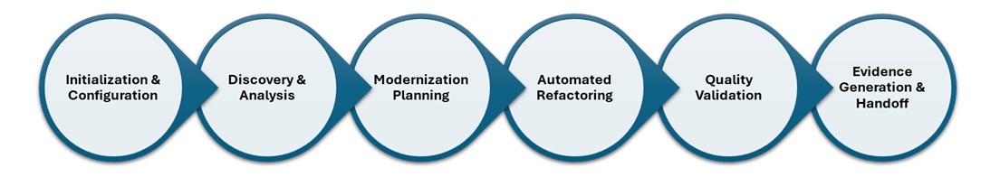

# Transformation Agent Design Document [WIP]

## 1. Overview

The Transformation Agent within the AI First Delivery program assist the migration engineer to modernize and refactor the targeted enteprise application accorsing to the application design. The agent uses an IDE-First approach to orchestrate the tranformation of .NET or Java workloads to supported Azure services and platforms.

## 2. Solution Summary

### Process Flow Overview

The Transformation Agent follows a structured process to modernize enterprise applications for Azure migration:

#### 1. **Initialization & Configuration**

* **Standards Profile Selection:** Configure customer-specific or program-level modernization standards (security, logging, configuration patterns)
* **Repository Connection:** Establish authenticated access to source repositories via Managed Identity and GitHub App integration
* **Baseline Assessment:** Validate project compilation status

#### 2. **Discovery & Analysis**

* **Solution Structure Parsing:** Inventory project hierarchy, dependencies, framework versions, and entry points
* **Anti-Pattern Detection:** Identify modernization candidates (direct file I/O, SMTP usage, hardcoded secrets, proprietary SDKs)
* **Secrets Scanning:** Flag plaintext secrets and credentials requiring Key Vault migration
* **Dependency Analysis:** Catalog third-party packages and evaluate Azure SDK replacement opportunities

#### 3. **Modernization Planning**

* **Transformation Strategy Generation:** Create prioritized refactor tasks based on detected patterns and selected standards profile
* **Azure Service Mapping:** Define target Azure services (Blob Storage, Service Bus, Key Vault, App Insights) for each modernization task
* **Risk Assessment:** Document potential breaking changes and rollback strategies
* **Tool Selection:** Identify appropriate VS Code extensions, analyzers, and Bandish orchestration tasks

#### 4. **Automated Refactoring**

* **Tool-Backed Transformations:** Execute refactoring via GitHub
* **Code Generation:** Replace direct implementations with Azure SDK patterns, externalize configuration, implement abstractions
* **Configuration Updates:** Generate Key Vault references, App Config integration, and Managed Identity configurations
* **Standards Compliance:** Apply logging patterns, telemetry instrumentation, and security best practices

#### 5. **Quality Validation**

* **Compilation Gates:** Verify ≥90% of projects compile successfully post-transformation
* **Test Execution:** Run existing test suites to validate functional integrity
* **Security Validation:** Ensure no plaintext secrets remain and Managed Identity is properly configured
* **Code Quality Checks:** Apply linting, static analysis, and dependency vulnerability scanning

#### 6. **Evidence Generation & Handoff**

* **Pull Request Creation:** Generate detailed PRs with transformation summaries, change descriptions, and validation results
* **Modernization Report:** Produce comprehensive documentation including Bill of Materials (BoM), RBAC requirements, and migration notes
* **Traceability Documentation:** Maintain lineage between discovered patterns, applied transformations, and generated artifacts
* **Stakeholder Distribution:** Deliver evidence packages via configured channels (SharePoint, email, repository artifacts)

**Key Workflow Characteristics:**

* **IDE-First Approach:** Leverages familiar development tools and extensions for seamless integration
* **Zero-Secrets Policy:** All authentication via Managed Identity with no stored credentials, secrets or Personal Access Tokens (PAT)
* **Quality-Gated Progress:** Each phase includes validation checkpoints to ensure transformation quality
* **Extensible Tool Integration:** Orchestrates multiple analysis and refactoring tools for comprehensive modernization coverage

## 3. Architectural Structure

### 3.1 Platform Architecture

* **Runtime:** AI Foundry agent runtime
* **Storage:** Cosmos DB thread storage, Azure Blob knowledge base
* **Identity:** Managed RBAC
* **Observability:** App Insights, Log Analytics, OpenTelemetry
* **Deployment:** AVM, Terraform, Bicep modules, private endpoints, VNet integration

### 3.2 Application Architecture

* **Agent Role:** Consumes Intake artifacts, produces refactor PRs and modernization reports
* **Interaction Model:**
  * Select standards profile
  * Connect repositories
  * Analyze & plan
  * Run tool-backed refactors
  * Generate PRs
  * Run quality gates
  * Publish evidence

## 4. Functional Requirements

* **Standards Catalog & Profiles:** Define program/customer rules for security, logging, telemetry, configuration
* **Discovery & Assessment:** Parse solution structure, frameworks, build files; flag anti-patterns and hard-coded secrets
* **Modernization Plan:** Generate prioritized refactor tasks, Azure service mappings, risk notes
* **Tool Reuse & Orchestration:** Invoke VS Code extensions, analyzers, language servers
* **Code & Config Generation:** Replace direct file I/O, secrets, proprietary SDKs; externalize configuration
* **Validation Quality Gates:** Compile, lint, test; block PRs on critical failures
* **Evidence Hand-off:** Emit Modernization Report, BoM, RBAC minimal, README

## 5. Non-Functional Requirements

* **Security & Privacy:** No secrets, keys, or PATs in repo or agent configuration; Managed Identity only; RBAC; traceability; extensibility
* **Performance & Usability:** Clear diagnostics, PR descriptions, tool extensibility
* **Platform NFRs:** Identity, privacy, scalability, reliability, operations, cost

## 6. Transformation Strategy by Use Case

This section is split into language-specific strategies to reflect differing ecosystems, tooling, and modernization accelerators. Migration mode columns indicate which engagement types surface an automated assist for the use case.

Each strategy row references a Knowledge Base (KB) playbook (see /kb directory) that provides:

1. Overview & applicability
2. Detection signals & prerequisites
3. Tool execution patterns (GitHub Copilot, Azure Modernization analyzers, Bandish orchestration)
4. Step-by-step transformation recipe
5. Validation & rollback guidance

Legend: (same) indicates identical handling across migration modes. Where a row is not materially automated in a mode, it is left blank. See the consolidated KB index at [KB Index](../strategies/kb/KB-INDEX.md) for summaries.

### 6.1 .NET Transformation Strategy

#### Application Layer (.NET)

| Use Case                              | Strategy                                  | Azure Target             | Azure Modernization | Bandish | Custom Tooling | KB Ref                          | Mechanism & Notes |
| ------------------------------------- | ------------------------------------------ | ------------------------ | ------------------- | ------- | -------------- | ------------------------------- | ----------------- |
| Direct file I/O                       | Refactor: introduce IFileStorage abstraction & async streams | Azure Blob Storage       | ✅ | ✅ | | [Storage Abstraction](../strategies/kb/storage/README.md) | Externalize config; resilience (retry/backoff); DI registration |
| SMTP email client                     | Replace SmtpClient with ACS Email SDK      | Azure Communication Svcs | ✅ | ✅ | | [Email Modernization](../strategies/kb/email/README.md) | Use Managed Identity; IOptions pattern; map legacy templates |
| Secrets in config                     | Externalize secrets to Key Vault references | Key Vault + Managed ID   | ✅ | ✅ | | [Secrets Externalization](../strategies/kb/secrets/README.md) | Use DefaultAzureCredential; enforce no plain secrets in appsettings.* |
| Proprietary SDKs (.NET)               | Replace w/ Azure SDK equivalents           | Azure SDK equivalents    | ✅ | ✅ | | [SDK Replacement](../strategies/kb/sdk-replacement/README.md) | Roslyn analyzers suggest replacements; add structured logging |
| Legacy logging/telemetry              | Add standardized ILogger + OTEL exporters  | App Insights             | ✅ | ✅ | | [Logging & Observability](../strategies/kb/logging/README.md) | Inject correlation, semantic conventions |
| log4net / Serilog / Windows Event Log | Migrate to OpenTelemetry on Azure | App Insights + OTEL | ✅ | ✅ | | [Logging & Observability](../strategies/kb/logging/README.md) | Transition from legacy logging frameworks to OTEL; structured logging; distributed tracing |
| Active Directory (on-prem) to Entra ID| Identity modernization to Entra ID & Managed Identity | Entra ID / Managed Identity | ✅ | ✅ | | [Identity Migration](../strategies/kb/identity/README.md) | Migrate auth flows to MSAL; replace LDAP/Kerberos; token scopes & RBAC mapping |
| Custom/Legacy identity provider       | Replace with Entra ID + externalized auth config | Entra ID / Managed Identity | ✅ | ✅ | | [Identity Migration](../strategies/kb/identity/README.md) | Deprecate custom token issuance; central claims mapping; rotate secrets |
| Legacy database (DB2, Oracle, SQL Server) | Migrate to managed database with identity auth | Azure SQL DB / SQL MI / PostgreSQL | ✅ | ✅ | | [Database Migration](../strategies/kb/KB-Database-Migration.md) | Modernize data layer with Managed Identity; connection string externalization; retry policies |

#### Integration & Messaging (.NET)

| Use Case          | Strategy                                   | Azure Target | Azure Modernization | Bandish | Custom Tooling | KB Ref                         | Mechanism & Notes |
| ----------------- | ------------------------------------------- | ------------ | ------------------- | ------- | -------------- | ------------------------------ | ----------------- |
| S3 client calls   | Refactor: replace AWSSDK.S3 with Blob SDK   | Blob Storage | ✅ | ✅ | | [Storage Abstraction](../strategies/kb/storage/README.md) | Map bucket/object -> container/blob; update retry & auth |
| Local file system I/O | Refactor: migrate to Azure File Storage | Azure Files | ✅ | ✅ | | [Storage Abstraction](../strategies/kb/storage/README.md) | Replace local file paths with Azure Files SMB/REST; support concurrent access |
| SQS queueing      | Refactor: migrate to Service Bus SDK        | Service Bus  | ✅ | ✅ | | [Messaging (SQS to Service Bus)](../strategies/kb/messaging/README.md) | Settlement semantics, DLQ routing, session handling |
| MSMQ / RabbitMQ   | Refactor: migrate to Service Bus SDK        | Service Bus  | ✅ | ✅ | | [Messaging (SQS to Service Bus)](../strategies/kb/messaging/README.md) | Replace legacy queues; message sessions; transaction support |
| CloudWatch Events | Rewire: translate event schema to Event Grid | Event Grid   | ✅ | ✅ | | [Events (CloudWatch to Grid)](../strategies/kb/events/README.md) | Add envelope translator & publisher component |
| Local/on-prem Kafka | Migrate to managed Kafka service | Confluent Cloud / Event Hubs | ✅ | ✅ | | [Events (CloudWatch to Grid)](../strategies/kb/events/README.md) | Transition to managed event streaming; producer/consumer config |
| In-memory / local Redis cache | Migrate to Azure Cache for Redis with MI | Azure Cache for Redis | ✅ | ✅ | | [Caching Migration](../strategies/kb/KB-Caching-Migration.md) | Replace local cache; Managed Identity auth; StackExchange.Redis configuration |

#### Data & Configuration (.NET)

| Use Case               | Strategy                                   | Azure Target           | Azure Modernization | Bandish | Custom Tooling | KB Ref                          | Mechanism & Notes |
| ---------------------- | ------------------------------------------- | ---------------------- | ------------------- | ------- | -------------- | ------------------------------- | ----------------- |
| Connection strings     | Externalize: App Config + Key Vault refs    | App Config + Key Vault | ✅ | ✅ | | [Configuration Externalization](../strategies/kb/config-externalization/README.md) | IConfiguration providers; feature flags for rollout |
| Unsupported frameworks | Upgrade to LTS & update project SDK/TFMs    | Supported LTS          | ✅ | ✅ | | [Framework Upgrade](../strategies/kb/framework-upgrade/README.md) | Edit csproj; apply analyzers/code fix providers |

### 6.2 Java Transformation Strategy

#### Application Layer (Java)

| Use Case                              | Strategy                                        | Azure Target             | Azure Modernization | Bandish | Custom Tooling | KB Ref                          | Mechanism & Notes |
| ------------------------------------- | ------------------------------------------------ | ------------------------ | ------------------- | ------- | -------------- | ------------------------------- | ----------------- |
| Direct file I/O                       | Refactor: introduce StoragePort + async/reactive API | Azure Blob Storage       | ✅ | ✅ | | [Storage Abstraction](../strategies/kb/storage/README.md) | Use Azure Storage v12; Reactor for async; externalize config |
| Local file I/O to persistent storage  | Convert local file operations to Azure File share mounts | Azure Files              | ✅ | ✅ | | [Storage Abstraction](../strategies/kb/storage/README.md) | Unified mount path; persist data across replicas; support failover |
| File-based logging                    | Convert file logging to console logging          | Azure Monitor            | ✅ | ✅ | | [Logging & Observability](../strategies/kb/logging/README.md) | Remove file appenders; console output; integrate with Azure Monitor |
| SMTP email client                     | Replace javax.mail with ACS Email SDK            | Azure Communication Svcs | ✅ | ✅ | | [Email Modernization](../strategies/kb/email/README.md) | Managed Identity / connection config; template mapping |
| Secrets in config                     | Externalize: Key Vault + managed identity         | Key Vault + Managed ID   | ✅ | ✅ | | [Secrets Externalization](../strategies/kb/secrets/README.md) | azure-security-keyvault-secrets + azure-identity; remove plaintext in YAML |
| Local TLS/mTLS certificates (JKS)     | Migrate certificates to Key Vault JCA provider   | Key Vault                | ✅ | ✅ | | [Secrets Externalization](../strategies/kb/secrets/README.md) | Transition from Java KeyStore to Key Vault JCA; maintain security posture |
| AWS Secret Manager                    | Migrate to Azure Key Vault                       | Key Vault                | ✅ | ✅ | | [Secrets Externalization](../strategies/kb/secrets/README.md) | Convert create, retrieve, update, delete operations to Key Vault APIs |
| Proprietary SDKs (Java)               | Replace with Azure SDK equivalents                | Azure SDK equivalents    | ✅ | ✅ | | [SDK Replacement](../strategies/kb/sdk-replacement/README.md) | OpenRewrite / custom recipes propose substitutions |
| Legacy logging/telemetry              | Add SLF4J + OpenTelemetry instrumentation         | App Insights             | ✅ | ✅ | | [Logging & Observability](../strategies/kb/logging/README.md) | Auto-instrumentation; semantic attributes |
| LDAP-based authentication             | Transition to Microsoft Entra ID authentication  | Entra ID                 | ✅ | ✅ | | [Identity Migration](../strategies/kb/identity/README.md) | Replace LDAP with Entra ID; OAuth2/OIDC flows |
| Active Directory (on-prem) to Entra ID| Identity modernization to Entra ID & Managed Identity | Entra ID / Managed Identity | ✅ | ✅ | | [Identity Migration](../strategies/kb/identity/README.md) | Migrate LDAP/Kerberos flows to OAuth2/OIDC; map groups to roles |
| Custom/Legacy identity provider       | Replace with Entra ID + externalized auth config  | Entra ID / Managed Identity | ✅ | ✅ | | [Identity Migration](../strategies/kb/identity/README.md) | Deprecate custom token service; claims normalization; secret rotation |
| Legacy database (Oracle, MySQL, PostgreSQL, Cassandra, MongoDB) | Migrate to managed database with Managed Identity | Azure SQL / MySQL / PostgreSQL / Cosmos DB | ✅ | ✅ | | [Database Migration](../strategies/kb/KB-Database-Migration.md) | Secure Managed Identity auth; connection pooling; migrate from on-prem/local DB |
| Oracle SQL dialect                    | Convert Oracle SQL to PostgreSQL dialect         | Azure PostgreSQL         | ✅ | ✅ | | [Database Migration](../strategies/kb/KB-Database-Migration.md) | Translate Oracle-specific queries, data types, functions to PostgreSQL equivalents |

#### Integration & Messaging (Java)

| Use Case          | Strategy                                         | Azure Target | Azure Modernization | Bandish | Custom Tooling | KB Ref                         | Mechanism & Notes |
| ----------------- | ----------------------------------------------- | ------------ | ------------------- | ------- | -------------- | ------------------------------ | ----------------- |
| S3 client calls   | Refactor: replace AWS S3 client with Blob SDK    | Blob Storage | ✅ | ✅ | | [Storage Abstraction](../strategies/kb/storage/README.md) | Update dependency injection (Spring) / factories |
| Spring RabbitMQ (AMQP/JMS) | Migrate to Azure Service Bus with Spring integration | Service Bus  | ✅ | ✅ | | [Messaging (SQS to Service Bus)](../strategies/kb/messaging/README.md) | Convert Spring AMQP/JMS with RabbitMQ to Service Bus; preserve messaging patterns |
| Apache ActiveMQ   | Modernize to Azure Service Bus                   | Service Bus  | ✅ | ✅ | | [Messaging (SQS to Service Bus)](../strategies/kb/messaging/README.md) | Convert ActiveMQ producers, consumers, connection factories; implement reliability best practices |
| AWS SQS queueing  | Refactor: migrate to Service Bus Java SDK        | Service Bus  | ✅ | ✅ | | [Messaging (SQS to Service Bus)](../strategies/kb/messaging/README.md) | Translate SQS constructs to Service Bus; preserve at-least-once delivery, batching, visibility |
| CloudWatch Events | Rewire: translate to Event Grid schema            | Event Grid   | ✅ | ✅ | | [Events (CloudWatch to Grid)](../strategies/kb/events/README.md) | Payload mapping & publisher service |

#### Data & Configuration (Java)

| Use Case               | Strategy                                      | Azure Target           | Azure Modernization | Bandish | Custom Tooling | KB Ref                          | Mechanism & Notes |
| ---------------------- | ---------------------------------------------- | ---------------------- | ------------------- | ------- | -------------- | ------------------------------- | ----------------- |
| Connection strings in messaging | Replace connection strings with Managed Identity | Event Hubs / Service Bus | ✅ | ✅ | | [Secrets Externalization](../strategies/kb/secrets/README.md) | Transition from connection strings/SAS to Managed Identity; use Microsoft Identity client libraries |
| Connection strings     | Externalize via App Config + Key Vault         | App Config + Key Vault | ✅ | ✅ | | [Configuration Externalization](../strategies/kb/config-externalization/README.md) | Spring Cloud Azure starters / manual config clients |
| Unsupported frameworks | Upgrade to supported Java LTS & dependency set | Supported LTS          | ✅ | ✅ | | [Framework Upgrade](../strategies/kb/framework-upgrade/README.md) | Update pom/gradle plugins; apply OpenRewrite recipes |

### 6.3 Cross-Cloud Platform Migrations

These scenarios focus on migrating compute and orchestration platforms from AWS to Azure. While infrastructure-focused, they may involve language-specific code changes depending on the platform.

| Use Case | Strategy | Azure Target | Azure Modernization | Bandish | Custom Tooling | KB Ref | Language | Mechanism & Notes |
| -------- | -------- | ------------ | ------------------- | ------- | -------------- | ------ | -------- | ----------------- |
| AWS Lambda to Azure Functions | Migrate serverless functions including handler signatures, context objects, triggers, and bindings | Azure Functions | ❌ | ❌ | ✅ | [Serverless Migration](../strategies/kb/serverless-migration/README.md) | .NET / Java | Transform function entry points (.NET: ILogger injection, HttpTrigger attributes; Java: @FunctionName annotations, ExecutionContext); translate environment variables to App Settings; map Lambda triggers to Function bindings (S3→Blob, SQS→Service Bus, API Gateway→HTTP); update deployment artifacts (AWS SAM→Bicep/ARM) |
| AWS EKS to AKS | Migrate Kubernetes workloads from EKS to AKS | Azure Kubernetes Service | ❌ | ❌ | ✅ | [Container Orchestration Migration](../strategies/kb/container-migration/README.md) | Language-Agnostic | Translate EKS-specific manifests (IAM roles for service accounts→Managed Identity/Workload Identity); convert AWS load balancer annotations to Azure; migrate Secrets Manager/Parameter Store to Key Vault with CSI driver; update image registry references (ECR→ACR); convert EKS add-ons to AKS extensions |
| AWS Elastic Beanstalk to App Service | Migrate managed platform applications from Elastic Beanstalk to App Service | Azure App Service | TBD | TBD | TBD | TBD | .NET / Java / Node.js / Python | Transform .ebextensions to App Service configuration; migrate environment variables; convert deployment archives; update health checks and auto-scaling rules |
| AWS App Runner to Container Apps | Migrate container workloads from App Runner to Container Apps | Azure Container Apps | TBD | TBD | TBD | TBD | Language-Agnostic | Convert App Runner service configuration to Container Apps YAML; translate auto-scaling policies; migrate secrets to Key Vault; update observability configurations |
| AWS EC2 to Azure VM | Migrate virtual machines from EC2 to Azure VMs | Azure Virtual Machines | TBD | TBD | TBD | TBD | Language-Agnostic | Use Azure Migrate for discovery and migration; convert security groups to NSGs; translate user data/cloud-init scripts; update IAM instance profiles to Managed Identity |
| AWS Fargate to Container Apps | Migrate serverless container workloads from Fargate to Container Apps | Azure Container Apps | TBD | TBD | TBD | TBD | Language-Agnostic | Convert ECS task definitions to Container Apps specifications; translate service configurations; migrate environment variables and secrets; update networking and ingress rules |
| Docker Compose to AKS | Modernize Docker Compose applications to Kubernetes on AKS | Azure Kubernetes Service | TBD | TBD | TBD | TBD | Language-Agnostic | Convert docker-compose.yml to Kubernetes manifests (Deployments, Services, ConfigMaps); translate volumes to PersistentVolumeClaims; add Ingress resources; configure RBAC and NetworkPolicies |
| GCP Cloud Run to Container Apps | Migrate serverless containers from Cloud Run to Container Apps | Azure Container Apps | TBD | TBD | TBD | TBD | Language-Agnostic | Translate Cloud Run service configurations; convert IAM bindings to Managed Identity; migrate secrets from Secret Manager to Key Vault; update ingress and autoscaling settings |
| GCP Cloud Functions to Azure Functions | Migrate serverless functions from Cloud Functions to Azure Functions | Azure Functions | TBD | TBD | TBD | TBD | .NET / Java / Node.js / Python | Transform function signatures and entry points; convert Pub/Sub triggers to Service Bus/Event Grid; migrate Cloud Storage triggers to Blob triggers; update environment configuration |
| GCP GKE to AKS | Migrate Kubernetes workloads from GKE to AKS | Azure Kubernetes Service | TBD | TBD | TBD | TBD | Language-Agnostic | Translate GKE-specific features (Workload Identity→Managed Identity); convert GCP load balancer configurations; migrate secrets from Secret Manager to Key Vault CSI; update monitoring and logging integrations |

## 7. Evidence Lineage & Reporting

* **Outputs:** PRs, patch sets, configuration artifacts, Modernization Report, RBAC minimal, BoM, change log
* **Reporting:** Markdown reports, JSON payloads, SharePoint/email distribution
* **Traceability:** Citations and lineage in PRs/reports mirroring Intake evidence model

## 8. Security, Compliance & Observability

* **Identity & Access:** Entra ID authN/Z, private networking, RBAC, DLP, Azure Policy
  * **Zero Secrets Policy:** No API keys, Personal Access Tokens (PATs), or stored credentials permitted
  * All authentication via Managed Identity with federated credentials (GitHub App, Azure services)
  * Service-to-service authentication uses workload identity federation
* **Observability:** App Insights, Log Analytics, Sentinel, OpenTelemetry
* **Compliance:** Content safety, prompt shielding, automatic cleanup of ephemeral artifacts

## 9. Implementation & Deployment

### 9.1 Prerequisites

#### 9.1.1 Infrastructure Prerequisites

* **Azure Subscription:** Contributor or Owner access for resource provisioning
* **AI Foundry Workspace:** Deployed with model endpoint (Azure OpenAI or equivalent)
* **Cosmos DB Account:** Thread storage with appropriate throughput (400-1000 RU/s minimum)
* **Azure Blob Storage:** Knowledge base hosting (Standard LRS or higher)
* **Application Insights + Log Analytics:** Workspace configured for telemetry ingestion
* **Azure Key Vault:** Deployed with RBAC or access policies for agent secrets
* **Networking (Optional but Recommended):**
  * VNet with subnets for private endpoints
  * Private endpoints for Cosmos DB, Blob Storage, Key Vault
  * Network Security Groups (NSGs) configured
  * DNS zones for private endpoint resolution

#### 9.1.2 Licensing & Permissions

* **Azure OpenAI or AI Foundry Model Access:** Approved quota and deployment slot
* **GitHub Access:** GitHub App with Managed Identity federation:
  * `repo` (full repository access)
  * `workflow` (if generating/updating Actions)
  * `pull_request` (create and update PRs)
  * **Note:** Personal Access Tokens (PATs) and API keys are not permitted; all authentication must use Managed Identity
* **Entra ID Tenant:** For identity integration and Managed Identity assignments
* **Azure RBAC Assignments:**
  * Contributor on resource group (for agent infrastructure)
  * Key Vault Secrets User/Officer (for secret access)
  * Storage Blob Data Contributor (for knowledge base)
  * Cosmos DB Built-in Data Contributor
* **Azure Policy Compliance:** Ensure deployment meets organizational guardrails (tags, regions, SKUs)

#### 9.1.3 Agent Runtime Prerequisites

* **AI Foundry Agent Runtime:** Deployed and operational
* **Managed Identity Configuration:**
  * System-assigned or user-assigned identity created
  * RBAC roles assigned for Azure service access
  * Federated credentials configured for GitHub App authentication
* **Knowledge Base Ingestion:**
  * All KB playbooks uploaded to Blob Storage (see [KB Index](../strategies/kb/KB-INDEX.md))
  * Bandish task specifications indexed (see [Bandish Index](bandish/README.md))
  * Vector embeddings generated (if using semantic search)
* **Standards Profile Catalog:**
  * Customer-specific or program-level standards loaded
  * Security rules (no plaintext secrets, approved SDKs)
  * Logging schema (structured format, correlation IDs)
  * Configuration patterns (Key Vault references, feature flags)
* **Tool Adapters Configured:**
  * VS Code extension integration (if applicable)
  * Azure Modernization analyzer endpoints
  * Bandish orchestration engine connection
  * Language servers (Roslyn for .NET, LSP for Java)

#### 9.1.4 Network Connectivity

* **Outbound Connectivity:**
  * Azure OpenAI / AI Foundry endpoints
  * GitHub API (api.github.com) and Git operations (github.com)
  * NuGet.org, Maven Central (for dependency resolution)
  * Azure service endpoints (management.azure.com, *.blob.core.windows.net, etc.)
* **Private Networking (Enterprise):**
  * Private Link configured for Azure services
  * Azure Firewall or NSG rules allow necessary outbound traffic
  * DNS resolution for private endpoints

#### 9.1.5 Developer Tools & Extensions

* **Integrated Development Environments:**
  * **Visual Studio 2022 (v17.8+):**
    * .NET workload installed (.NET 6, 7, 8 SDK)
    * Azure development workload
    * GitHub Copilot extension
    * Azure Account extension for authentication
  * **Visual Studio Code:**
    * Latest stable version
    * Remote development capability (for container-based workflows)
* **VS Code Extensions (Recommended):**
  * **C# Dev Kit** (for .NET development)
  * **Extension Pack for Java** (for Java development)
  * **Azure Tools Extension Pack:**
    * Azure Account
    * Azure Resources
    * Azure Functions
    * Azure App Service
  * **GitHub Copilot + GitHub Copilot Chat**
  * **Azure Modernization Analyzer** (custom extension for pattern detection)
  * **OpenRewrite** (for Java refactoring automation)
  * **REST Client** (for API testing)
  * **YAML** (for configuration file editing)
  * **Bicep** (for Infrastructure as Code authoring)
* **Visual Studio Extensions:**
  * **GitHub Copilot for Visual Studio**
  * **Azure Development Tools**
  * **.NET Upgrade Assistant** (for framework migration)
  * **ReSharper or Roslyn Analyzers** (for code quality and refactoring suggestions)
* **Bandish Orchestration Engine:**
  * Bandish CLI installed and configured
  * Connection to agent runtime established
  * Task templates loaded (see [Bandish Index](bandish/README.md))
  * Execution permissions configured for automated refactoring workflows
* **Build & Package Management Tools:**
  * **.NET:** dotnet CLI (SDK 6.0+, 8.0 recommended)
  * **Java:**
    * JDK 11, 17, or 21 (Eclipse Temurin or Microsoft Build of OpenJDK)
    * Maven 3.8+ or Gradle 7.5+
  * **Node.js:** v18+ LTS (for JavaScript/TypeScript tooling)
* **Source Control & CI/CD:**
  * **Git:** v2.30+ with credential manager
  * **GitHub CLI (gh):** For PR automation and repository operations
  * **Azure CLI (az):** v2.50+ for Azure resource management
* **Code Analysis & Quality Tools:**
  * **SonarLint** (IDE extension for continuous code quality feedback)
  * **Snyk or Dependabot** (for vulnerability scanning)
  * **.NET:** `dotnet format`, `dotnet test`
  * **Java:** SpotBugs, Checkstyle, PMD (optional but recommended)
* **Container & Kubernetes Tools (Optional):**
  * **Docker Desktop** (for local container testing)
  * **kubectl** (for Kubernetes manifest validation)
  * **Helm** (for Kubernetes package management)
  * **Azure Dev CLI (azd):** For infrastructure provisioning workflows

### 9.2 Transformation Engagement Prerequisites

These prerequisites apply per-engagement when executing a modernization task.

#### 9.2.1 Project-Level Requirements

* **Source Repository Access:**
  * GitHub or Azure DevOps repository accessible with appropriate credentials
  * Branch protection rules documented (for PR target configuration)
  * CI/CD pipelines present (optional but recommended for validation)
* **Build Files Present:**
  * .NET: `*.csproj`, `*.sln`, or `Directory.Build.props`
  * Java: `pom.xml` (Maven) or `build.gradle`/`settings.gradle` (Gradle)
* **Baseline Compilation:**
  * Project compiles successfully, or documented build failures are known
  * Dependencies resolvable from package feeds
* **Test Suite (Recommended):**
  * Unit tests present for quality gate validation
  * Test execution infrastructure configured

#### 9.2.2 Standards Profile Selection

* **Profile Configured for Customer/Program:**
  * Security standards (secret handling, encryption, certificate management)
  * Logging and observability standards (structured logging, OTEL exporters)
  * Configuration management rules (externalization, feature flags)
* **Azure Target Service Mappings:**
  * File I/O → Blob Storage
  * SMTP → Azure Communication Services
  * Secrets → Key Vault
  * Messaging → Service Bus
  * Events → Event Grid
* **SDK Allow/Block Lists:**
  * Approved Azure SDKs with minimum versions
  * Deprecated or proprietary SDKs to replace

#### 9.2.3 Discovery & Assessment Results

* **Solution Structure Parsed:**
  * Project hierarchy, dependencies, and references inventoried
  * Entry points (controllers, main classes) identified
* **Frameworks & Dependencies Inventoried:**
  * Target framework versions (.NET 6+, Java 11/17/21)
  * Third-party packages cataloged with versions
  * Transitive dependency tree analyzed
* **Anti-Patterns Flagged:**
  * Direct file I/O without abstraction
  * SMTP client usage
  * Plaintext secrets in configuration
  * Hard-coded connection strings
  * Proprietary or AWS/GCP SDKs
* **Secrets Scan Completed:**
  * No high-severity secrets in source control
  * Existing secrets documented for migration to Key Vault

#### 9.2.4 Quality Gates & Validation

* **Compilation Threshold:** Default ≥90% projects compile post-transformation
* **Test Pass Threshold:** Configurable (e.g., ≥80% tests pass, no new failures)
* **Security Validation:**
  * No plaintext secrets in transformed code
  * Key Vault references correctly configured
  * Managed Identity enabled where applicable
* **PR Approval Workflow:**
  * Code owners identified for review
  * Branch policies configured (minimum reviewers, status checks)
  * CI pipeline runs on PR (build + test validation)

### 9.3 Deployment

* **Deployment Strategy:** Managed environments, private endpoints, AVM/Terraform/Bicep parity with Intake
* **Infrastructure as Code:**
  * Azure Verified Modules (AVM) for standardized resource deployment
  * Terraform or Bicep templates for multi-environment consistency
  * Parameterized deployments for dev/staging/production
* **Operational Readiness:**
  * Monitoring alerts configured (App Insights, Log Analytics)
  * Runbooks for common operations (knowledge base refresh, profile updates)
  * Incident response procedures documented

## 10. Success Metrics & Acceptance Criteria

* **PR acceptance rate:** ≥ 60%
* **Compile/tests pass:** ≥ 90% post-transformation
* **Time review:** Median ≤ 1 business day
* **Reuse ratio:** ≥ 80% via extensions/analyzers
* **MVP:** .NET/Java refactor PR compiles, secrets removed, config externalized, evidence bundle delivered

## 11. Open Items

* Populate concrete standards profiles, SDK versions, logging schema, tool adapter specifics
* Extend transformation recipes beyond .NET/Java
* Align Modernization Report schema with ASR agent

## 12. Appendix: Traceability & Ops

* **Telemetry:** Instrument analysis steps, tool calls, PR creation gate outcomes
* **Cleanup:** Persist approved program artifacts, follow Intake conventions
