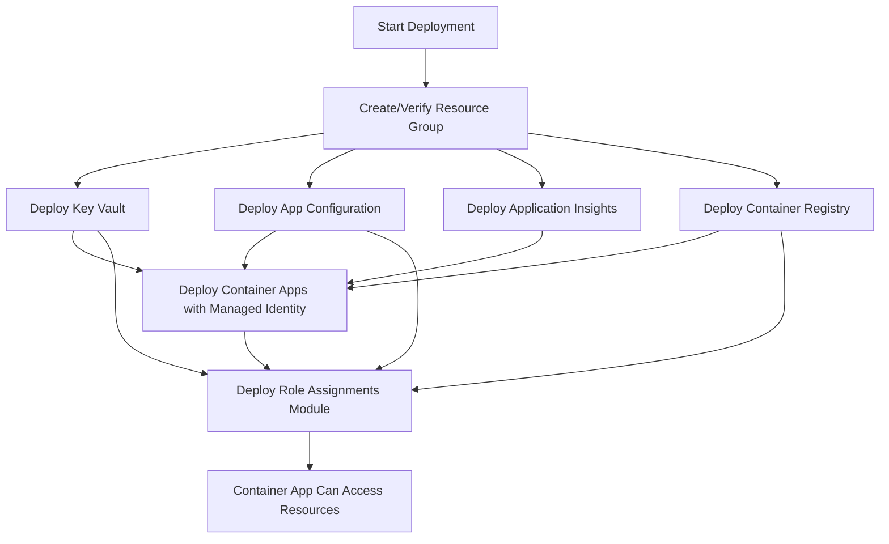

# Automated Infrastructure Deployment Guide

## Overview

This guide documents the automated deployment approach for Customer Order Services Azure infrastructure, including automatic role assignment provisioning via Bicep templates.

## Architecture

### Automated Role Assignments

The infrastructure deployment automatically provisions three critical role assignments for the Container App managed identity:

1. **Key Vault Secrets User** (Role ID: `4633458b-17de-408a-b874-1327992a3a45`)
   - Scope: Key Vault resource (`kv-customerorder-dev`)
   - Purpose: Read database password and other secrets
   - Required for: MicroProfile ConfigSource integration with Key Vault

2. **App Configuration Data Reader** (Role ID: `516239f1-63e1-4d78-a4de-a74fb236a071`)
   - Scope: App Configuration resource (`appconfig-customerorder`)
   - Purpose: Read configuration values (database host, telemetry settings)
   - Required for: MicroProfile ConfigSource integration with App Configuration

3. **AcrPull** (Role ID: `7f951dda-4ed3-4680-a7ca-43fe172d538d`)
   - Scope: Container Registry resource (`customerorderdevacr`)
   - Purpose: Pull container images during deployment
   - Required for: Container Apps to pull application images from ACR

### Deployment Flow



## Deployment Methods

### Method 1: PowerShell Script with Post-Deployment (Recommended)

The deployment uses a **two-stage approach** to avoid chicken-and-egg problems with Key Vault secret references:

**Stage 1: Infrastructure Deployment**
```powershell
# Navigate to infrastructure directory
cd C:\AIMigrate\java\appmodernization-samples\monolith-websphere-855\infra

# Deploy infrastructure (Container App with placeholder DB_PASSWORD)
az deployment group create `
    --resource-group rg-customerorder-dev `
    --template-file .\main.bicep `
    --parameters baseName=customerorder environment=dev useContainerApps=true
```

**Stage 2: Secrets Configuration**
```powershell
# Configure Container App secrets with Key Vault references
.\post-deployment-secrets.ps1 `
    -ResourceGroupName "rg-customerorder-dev" `
    -ContainerAppName "ca-customerorder-dev" `
    -KeyVaultName "kv-customerorder-dev"
```

**Why Two-Stage Deployment?**
- Container Apps cannot reference Key Vault secrets without proper role assignments
- Role assignments require Container App managed identity (created during deployment)
- Initial deployment uses placeholder for `DB_PASSWORD`
- Post-deployment script configures Key Vault secret references after role assignments complete

**Script Features:**
- ✅ Validates Container App provisioning state
- ✅ Verifies role assignments exist
- ✅ Configures secrets with Key Vault references
- ✅ Updates environment variables to use `secretRef`
- ✅ Validates DB_PASSWORD is no longer plain text
- ✅ Ensures secure configuration

### Method 2: Azure CLI Direct (Two-Stage)

For CI/CD pipelines or manual deployment:

**Stage 1: Deploy Infrastructure**

```bash
# Set variables
RESOURCE_GROUP="rg-customerorder-dev"
LOCATION="northeurope"
BASE_NAME="customerorder"
ENVIRONMENT="dev"

# Create resource group
az group create --name $RESOURCE_GROUP --location $LOCATION

# Deploy infrastructure
az deployment group create \
    --name "customerorder-infra-$(date +%Y%m%d-%H%M%S)" \
    --resource-group $RESOURCE_GROUP \
    --template-file ./main.bicep \
    --parameters baseName=$BASE_NAME environment=$ENVIRONMENT useContainerApps=true \
    --verbose

# Retrieve outputs
az deployment group show \
    --name <deployment-name> \
    --resource-group $RESOURCE_GROUP \
    --query properties.outputs \
    -o table
```

**Stage 2: Configure Secrets**

```bash
# Run post-deployment script
./post-deployment-secrets.ps1 \
    -ResourceGroupName "rg-customerorder-dev" \
    -ContainerAppName "ca-customerorder-dev" \
    -KeyVaultName "kv-customerorder-dev"
```

### Method 3: Azure Portal

**Note:** Portal deployment requires manual post-deployment step for secrets configuration.

1. Navigate to **Resource Groups** → Select your resource group → **Deployments**
2. Click **Create** → **Build your own template**
3. Upload `main.bicep` and parameter files
4. Configure parameters:
   - `baseName`: customerorder
   - `environment`: dev
   - `useContainerApps`: true
5. Click **Review + Create** → **Create**

## Bicep Module Structure

### Main Orchestrator (`main.bicep`)

Orchestrates all resource deployments with proper dependencies:

```bicep
// Deploy core resources
module keyVault './modules/keyvault.bicep' = { ... }
module appConfig './modules/appconfig.bicep' = { ... }
module insights './modules/insights.bicep' = { ... }
module acr './modules/acr.bicep' = { ... }

// Deploy Container Apps with managed identity
module containerApps './modules/containerapps.bicep' = if (useContainerApps) { ... }

// Automatically assign roles to managed identity
module roleAssignments './modules/roleassignments.bicep' = if (useContainerApps) {
  name: 'roleAssignmentsDeploy'
  params: {
    principalId: containerApps.outputs.containerAppPrincipalId  // Dynamic from Container App
    keyVaultName: kvName
    appConfigName: appConfigName
    acrName: acrName
    location: location
  }
  dependsOn: [
    keyVault
    appConfig
  ]
}
```

**Key Design Decisions:**

1. **Conditional Deployment**: Role assignments only deploy when `useContainerApps=true`
2. **Dynamic Principal ID**: Principal ID passed from Container Apps module output
3. **Explicit Dependencies**: Ensures resources exist before role assignments
4. **Idempotent**: Uses `guid()` for deterministic role assignment names

### Role Assignments Module (`modules/roleassignments.bicep`)

Provisions three role assignments using Azure RBAC built-in roles:

```bicep
// Key Vault Secrets User role
resource kvRole 'Microsoft.Authorization/roleAssignments@2022-04-01' = {
  name: guid(keyVaultName, principalId, 'kv-secrets-user')
  scope: kv
  properties: {
    principalId: principalId
    roleDefinitionId: subscriptionResourceId('Microsoft.Authorization/roleDefinitions', '4633458b-17de-408a-b874-1327992a3a45')
    principalType: 'ServicePrincipal'
  }
}

// App Configuration Data Reader role
resource appConfigRole 'Microsoft.Authorization/roleAssignments@2022-04-01' = {
  name: guid(appConfigName, principalId, 'appconfig-data-reader')
  scope: appConfig
  properties: {
    principalId: principalId
    roleDefinitionId: subscriptionResourceId('Microsoft.Authorization/roleDefinitions', '516239f1-63e1-4d78-a4de-a74fb236a071')
    principalType: 'ServicePrincipal'
  }
}

// AcrPull role
resource acrRole 'Microsoft.Authorization/roleAssignments@2022-04-01' = {
  name: guid(acrName, principalId, 'acr-pull')
  scope: acr
  properties: {
    principalId: principalId
    roleDefinitionId: subscriptionResourceId('Microsoft.Authorization/roleDefinitions', '7f951dda-4ed3-4680-a7ca-43fe172d538d')
    principalType: 'ServicePrincipal'
  }
}
```

**Important Notes:**

- **Deterministic Naming**: Uses `guid()` with consistent inputs for idempotency
- **Resource Scoping**: Each role scoped to specific resource (not resource group)
- **Principal Type**: `ServicePrincipal` for managed identities
- **Subscription Scoping**: Role definition IDs scoped at subscription level

## Post-Deployment Configuration

### 1. Store Secrets in Key Vault

```bash
# Database password (32-character generated password)
az keyvault secret set \
    --vault-name kv-customerorder-dev \
    --name db-password \
    --value '<32-char-password>'

# Verify secret stored
az keyvault secret show \
    --vault-name kv-customerorder-dev \
    --name db-password \
    --query value -o tsv
```

### 2. Configure App Configuration Values

```bash
# Database host (Azure PostgreSQL)
az appconfig kv set \
    --name appconfig-customerorder \
    --key db:host \
    --value psql-customerorder-dev.postgres.database.azure.com

# Database port
az appconfig kv set \
    --name appconfig-customerorder \
    --key db:port \
    --value 5432

# Database name
az appconfig kv set \
    --name appconfig-customerorder \
    --key db:name \
    --value orderdb

# Database user
az appconfig kv set \
    --name appconfig-customerorder \
    --key db:user \
    --value dbadmin

# Telemetry sampling rate (10%)
az appconfig kv set \
    --name appconfig-customerorder \
    --key telemetry:sampling \
    --value 0.1
```

### 3. Build and Push Container Image

```bash
# Build Docker image
cd C:\AIMigrate\java\appmodernization-samples\monolith-websphere-855
docker build -f Deployment/Dockerfile.liberty -t customerorder-api:latest .

# Login to ACR
az acr login --name customerorderdevacr

# Tag and push image
docker tag customerorder-api:latest customerorderdevacr.azurecr.io/customerorder-api:latest
docker push customerorderdevacr.azurecr.io/customerorder-api:latest

# Optional: Push versioned tag
docker tag customerorder-api:latest customerorderdevacr.azurecr.io/customerorder-api:v1.0.0
docker push customerorderdevacr.azurecr.io/customerorder-api:v1.0.0
```

### 4. Update Container App Environment Variables

```bash
# Get Application Insights connection string
INSIGHTS_CONN=$(az monitor app-insights component show \
    --app customerorder-insights \
    --resource-group rg-customerorder-dev \
    --query connectionString -o tsv)

# Get database password from Key Vault
DB_PASSWORD=$(az keyvault secret show \
    --vault-name kv-customerorder-dev \
    --name db-password \
    --query value -o tsv)

# Update Container App
az containerapp update \
    --name ca-customerorder-dev \
    --resource-group rg-customerorder-dev \
    --image customerorderdevacr.azurecr.io/customerorder-api:latest \
    --set-env-vars \
        AZURE_KEYVAULT_ENDPOINT=https://kv-customerorder-dev.vault.azure.net/ \
        AZURE_APPCONFIGURATION_ENDPOINT=https://appconfig-customerorder.azconfig.io \
        AZURE_TENANT_ID=<tenant-id> \
        APPLICATIONINSIGHTS_CONNECTION_STRING="$INSIGHTS_CONN" \
        DB_HOST=psql-customerorder-dev.postgres.database.azure.com \
        DB_PORT=5432 \
        DB_NAME=orderdb \
        DB_USER=dbadmin \
        DB_PASSWORD="$DB_PASSWORD" \
        OTEL_SERVICE_NAME=customerorder-api \
        OTEL_TRACES_SAMPLER=parentbased_traceidratio \
        OTEL_TRACES_SAMPLER_ARG=0.1 \
        OTEL_RESOURCE_ATTRIBUTES="deployment.environment=dev" \
        OTEL_TRACES_EXPORTER=none \
        OTEL_METRICS_EXPORTER=none \
        OTEL_LOGS_EXPORTER=none
```

## Validation

### 1. Verify Role Assignments

```bash
# Get Container App managed identity principal ID
PRINCIPAL_ID=$(az containerapp show \
    --name ca-customerorder-dev \
    --resource-group rg-customerorder-dev \
    --query identity.principalId -o tsv)

# List role assignments for managed identity
az role assignment list \
    --assignee $PRINCIPAL_ID \
    --query "[].{Role:roleDefinitionName, Scope:scope}" \
    -o table

# Expected output:
# Role                              Scope
# --------------------------------  ----------------------------------------------------------
# Key Vault Secrets User            /subscriptions/.../Microsoft.KeyVault/vaults/kv-customerorder-dev
# App Configuration Data Reader     /subscriptions/.../Microsoft.AppConfiguration/configurationStores/appconfig-customerorder
# AcrPull                           /subscriptions/.../Microsoft.ContainerRegistry/registries/customerorderdevacr
```

### 2. Test Key Vault Access

```bash
# Test from Container App (via exec or logs)
# The application logs should show successful secret retrieval:
# "Successfully retrieved secret: db-password from Key Vault"
```

### 3. Test App Configuration Access

```bash
# Check application logs for configuration retrieval:
# "Successfully loaded configuration from App Configuration"
# "db:host = psql-customerorder-dev.postgres.database.azure.com"
```

### 4. Test Container Image Pull

```bash
# Check Container App revision provisioning status
az containerapp revision list \
    --name ca-customerorder-dev \
    --resource-group rg-customerorder-dev \
    --query "[0].{Name:name, Status:provisioningState, Running:runningState}" \
    -o table

# Expected: Status=Succeeded, Running=Running
```

### 5. Test Application Health

```bash
# Health endpoint
curl https://ca-customerorder-dev.<region>.azurecontainerapps.io/health

# Expected response:
# {
#   "status": "UP",
#   "checks": [
#     {"name": "datasource-orderds", "status": "UP"},
#     {"name": "customer-order-services-liveness", "status": "UP"}
#   ]
# }
```

## CI/CD Pipeline Integration

### Azure DevOps Pipeline Example

```yaml
trigger:
  branches:
    include:
      - main
  paths:
    include:
      - infra/**
      - Deployment/**

variables:
  resourceGroup: 'rg-customerorder-dev'
  location: 'northeurope'
  baseName: 'customerorder'
  environment: 'dev'

stages:
  - stage: InfrastructureDeployment
    displayName: 'Deploy Azure Infrastructure'
    jobs:
      - job: DeployBicep
        displayName: 'Deploy Bicep Templates'
        pool:
          vmImage: 'ubuntu-latest'
        steps:
          - task: AzureCLI@2
            displayName: 'Create Resource Group'
            inputs:
              azureSubscription: 'Azure Service Connection'
              scriptType: 'bash'
              scriptLocation: 'inlineScript'
              inlineScript: |
                az group create --name $(resourceGroup) --location $(location)
          
          - task: AzureCLI@2
            displayName: 'Deploy Infrastructure with Role Assignments'
            inputs:
              azureSubscription: 'Azure Service Connection'
              scriptType: 'bash'
              scriptLocation: 'inlineScript'
              inlineScript: |
                az deployment group create \
                  --name "customerorder-infra-$(Build.BuildId)" \
                  --resource-group $(resourceGroup) \
                  --template-file ./infra/main.bicep \
                  --parameters baseName=$(baseName) environment=$(environment) useContainerApps=true \
                  --verbose

  - stage: ApplicationDeployment
    displayName: 'Deploy Application'
    dependsOn: InfrastructureDeployment
    jobs:
      - job: BuildAndPush
        displayName: 'Build and Push Docker Image'
        pool:
          vmImage: 'ubuntu-latest'
        steps:
          - task: Docker@2
            displayName: 'Build Docker Image'
            inputs:
              command: 'build'
              Dockerfile: 'Deployment/Dockerfile.liberty'
              tags: |
                $(Build.BuildId)
                latest
          
          - task: AzureCLI@2
            displayName: 'Push to ACR'
            inputs:
              azureSubscription: 'Azure Service Connection'
              scriptType: 'bash'
              scriptLocation: 'inlineScript'
              inlineScript: |
                az acr login --name customerorderdevacr
                docker tag customerorder-api:latest customerorderdevacr.azurecr.io/customerorder-api:$(Build.BuildId)
                docker push customerorderdevacr.azurecr.io/customerorder-api:$(Build.BuildId)
          
          - task: AzureCLI@2
            displayName: 'Update Container App'
            inputs:
              azureSubscription: 'Azure Service Connection'
              scriptType: 'bash'
              scriptLocation: 'inlineScript'
              inlineScript: |
                az containerapp update \
                  --name ca-customerorder-dev \
                  --resource-group $(resourceGroup) \
                  --image customerorderdevacr.azurecr.io/customerorder-api:$(Build.BuildId)
```

### GitHub Actions Workflow Example

```yaml
name: Deploy Customer Order Services

on:
  push:
    branches: [main]
    paths:
      - 'infra/**'
      - 'Deployment/**'
  workflow_dispatch:

env:
  AZURE_SUBSCRIPTION_ID: ${{ secrets.AZURE_SUBSCRIPTION_ID }}
  RESOURCE_GROUP: rg-customerorder-dev
  LOCATION: northeurope
  BASE_NAME: customerorder
  ENVIRONMENT: dev

jobs:
  deploy-infrastructure:
    runs-on: ubuntu-latest
    steps:
      - uses: actions/checkout@v3
      
      - name: Azure Login
        uses: azure/login@v1
        with:
          creds: ${{ secrets.AZURE_CREDENTIALS }}
      
      - name: Deploy Infrastructure
        run: |
          az deployment group create \
            --name "customerorder-infra-${{ github.run_number }}" \
            --resource-group ${{ env.RESOURCE_GROUP }} \
            --template-file ./infra/main.bicep \
            --parameters baseName=${{ env.BASE_NAME }} environment=${{ env.ENVIRONMENT }} useContainerApps=true \
            --verbose

  deploy-application:
    needs: deploy-infrastructure
    runs-on: ubuntu-latest
    steps:
      - uses: actions/checkout@v3
      
      - name: Azure Login
        uses: azure/login@v1
        with:
          creds: ${{ secrets.AZURE_CREDENTIALS }}
      
      - name: Build Docker Image
        run: |
          docker build -f Deployment/Dockerfile.liberty -t customerorder-api:${{ github.run_number }} .
      
      - name: Push to ACR
        run: |
          az acr login --name customerorderdevacr
          docker tag customerorder-api:${{ github.run_number }} customerorderdevacr.azurecr.io/customerorder-api:${{ github.run_number }}
          docker push customerorderdevacr.azurecr.io/customerorder-api:${{ github.run_number }}
      
      - name: Update Container App
        run: |
          az containerapp update \
            --name ca-customerorder-dev \
            --resource-group ${{ env.RESOURCE_GROUP }} \
            --image customerorderdevacr.azurecr.io/customerorder-api:${{ github.run_number }}
```

## Troubleshooting

### Role Assignment Failures

**Problem**: Role assignment deployment fails with "Principal not found"

**Solution**: Ensure Container Apps module completes before role assignments. Check dependency chain:
```bicep
dependsOn: [
  keyVault
  appConfig
]
```

**Problem**: "The role assignment already exists"

**Solution**: Bicep uses deterministic GUID for idempotency. If redeploying, existing assignments will be detected and skipped. To clean up:
```bash
az role assignment delete --ids <assignment-id>
```

### Container App Image Pull Failures

**Problem**: Container App shows "ImagePullBackOff" error

**Solution**: Verify AcrPull role assignment:
```bash
az role assignment list --assignee <principal-id> --query "[?roleDefinitionName=='AcrPull']"
```

If missing, redeploy infrastructure or manually assign:
```bash
az role assignment create \
    --role AcrPull \
    --assignee-object-id <principal-id> \
    --assignee-principal-type ServicePrincipal \
    --scope /subscriptions/<sub-id>/resourceGroups/<rg>/providers/Microsoft.ContainerRegistry/registries/<acr-name>
```

### Key Vault Access Denied

**Problem**: Application logs show "Access denied to Key Vault secret"

**Solution**: Verify Key Vault Secrets User role assignment and Key Vault RBAC mode:
```bash
# Check role assignment
az role assignment list --assignee <principal-id> --query "[?roleDefinitionName=='Key Vault Secrets User']"

# Verify Key Vault uses RBAC (not access policies)
az keyvault show --name kv-customerorder-dev --query properties.enableRbacAuthorization

# Should return: true
```

### App Configuration Access Denied

**Problem**: Application logs show "Access denied to App Configuration"

**Solution**: Verify App Configuration Data Reader role assignment:
```bash
az role assignment list --assignee <principal-id> --query "[?roleDefinitionName=='App Configuration Data Reader']"
```

## Best Practices

1. **Use Bicep Modules**: Keep role assignments in separate module for reusability
2. **Deterministic Naming**: Use `guid()` for consistent role assignment names
3. **Explicit Dependencies**: Define `dependsOn` to ensure correct deployment order
4. **Least Privilege**: Assign minimum required roles (Secrets User, not Contributor)
5. **Resource Scoping**: Scope roles to specific resources, not resource groups
6. **Idempotent Deployments**: Design templates to be safely redeployed
7. **CI/CD Integration**: Automate infrastructure and application deployment together
8. **Validate Post-Deployment**: Always verify role assignments after deployment

## Security Considerations

1. **Managed Identity**: Use system-assigned managed identity (no credentials to rotate)
2. **RBAC Authorization**: Key Vault uses RBAC, not legacy access policies
3. **Least Privilege Roles**: 
   - Secrets User (not Secrets Officer or Contributor)
   - Data Reader (not Data Owner)
   - AcrPull (not AcrPush)
4. **Resource-Level Scoping**: Each role scoped to specific resource
5. **No Service Principal**: Managed identity eliminates credential management
6. **Audit Logging**: Monitor role assignment changes via Azure Activity Log

## References

- [Azure Managed Identity Overview](https://learn.microsoft.com/azure/active-directory/managed-identities-azure-resources/overview)
- [Azure RBAC Built-in Roles](https://learn.microsoft.com/azure/role-based-access-control/built-in-roles)
- [Bicep Role Assignment Resource](https://learn.microsoft.com/azure/templates/microsoft.authorization/roleassignments)
- [Key Vault RBAC Guide](https://learn.microsoft.com/azure/key-vault/general/rbac-guide)
- [App Configuration RBAC](https://learn.microsoft.com/azure/azure-app-configuration/concept-enable-rbac)
- [Container Apps Managed Identity](https://learn.microsoft.com/azure/container-apps/managed-identity)

---

**Document Version**: 1.0  
**Last Updated**: 2025-11-11  
**Status**: Automated Deployment Approach Implemented
