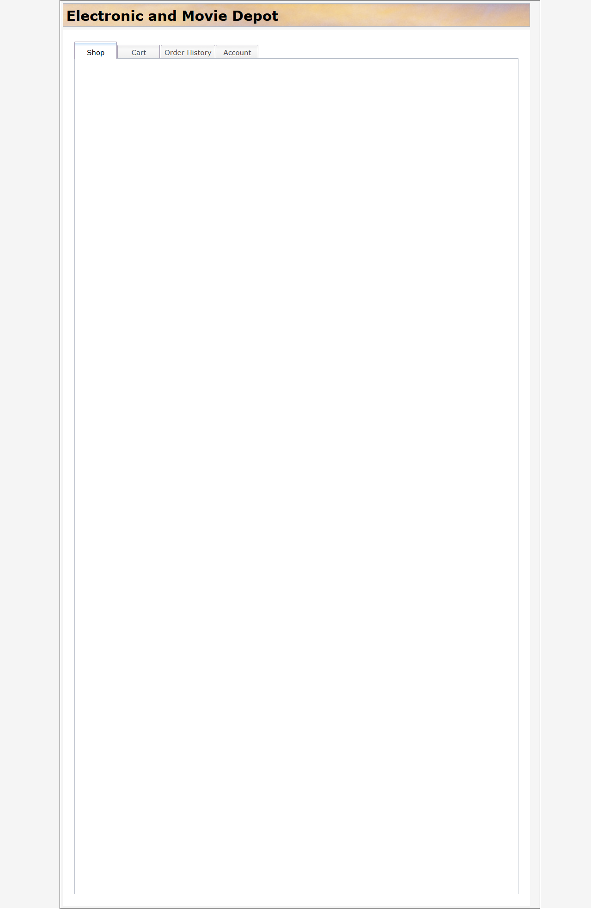

# TASK-008 Diagnostics Report

**Date:** November 18, 2025  
**Status:** Investigation Complete  
**Application URL:** https://ca-customerorder-dev.agreeableriver-e0e3f1d8.northeurope.azurecontainerapps.io/CustomerOrderServicesWeb/

---

## Executive Summary

Investigation revealed **UI is partially functional** with specific issues preventing proper display of categories and products. The root causes are identified and fixable.

### Critical Findings:
1. ✅ **Product API works** - Returns 200 OK when provided with `categoryId` parameter
2. ❌ **Product API fails** - Returns 400 Bad Request when called without `categoryId`
3. ❌ **UI not displaying categories** - Category menu is empty despite API returning data
4. ⚠️ **JavaScript errors** - Customer API 401, undefined resource 404
5. ✅ **Dojo Toolkit loading** - CDN loads successfully, widgets instantiate

---

## Issue 1: Product API 400 Error ❌

### Symptoms:
- GET `/jaxrs/Product` returns 400 Bad Request
- UI shows blank product grid
- Console shows no specific error for Product API

### Root Cause Analysis:

**Code Review:** `ProductResource.java` lines 95-102
```java
@GET
@Produces(MediaType.APPLICATION_JSON)
public List<Product> getProductsByCategory(@QueryParam(value="categoryId") int categoryId)
{
    System.out.println(categoryId);
    if(categoryId <= 0)
    {
        throw new WebApplicationException(Response.Status.BAD_REQUEST);
    }
```

**Problem:** The API **requires** a `categoryId` query parameter and returns 400 if:
- Parameter is missing (defaults to 0)
- Parameter is <= 0

### Testing Results:

**Without categoryId (fails):**
```powershell
GET /jaxrs/Product
Response: 400 Bad Request
```

**With categoryId (works):**
```powershell
GET /jaxrs/Product?categoryId=1
Response: 200 OK
Body: [
  {"name":"Laptop Pro","price":999.99,"categories":[...]},
  {"name":"Smartphone X","price":599.99,"categories":[...]},
  {"name":"Wireless Headphones","price":299.99,"categories":[...]},
  {"name":"Desktop Workstation","price":1499.99,"categories":[...]}
]
```

**Result:** 4 products returned for category 1 (Electronics)

### Impact:
- **Severity:** Medium
- **User Impact:** Cannot browse all products, must select a category first
- **Business Logic:** Working as designed (requires category selection)
- **UI Issue:** Frontend is not handling the category selection properly

---

## Issue 2: UI Not Displaying Categories ❌

### Symptoms:
- Category menu (`#categoryMenu`) is empty
- No category links visible in UI
- Product grid shows default query `{categoryId:'2'}` but doesn't update

### Playwright Investigation:

**Page Load:**
- URL: https://ca-customerorder-dev.agreeableriver-e0e3f1d8.northeurope.azurecontainerapps.io/CustomerOrderServicesWeb/#shopPage
- Title: "Electronics and Movie Depot"
- Tabs visible: Shop, Cart, Order History, Account
- Shop tab selected but content area is blank

**Console Errors:**
```
[DEBUG] Loading Account Controller @ /CustomerOrderServicesWeb/dojo_depot/depot/AccountController.js:16
[ERROR] Failed to load resource: the server responded with a status of 401 () @ /CustomerOrderServicesWeb/jaxrs/Customer:0
[ERROR] Error Loading Account @ /CustomerOrderServicesWeb/dojo_depot/depot/AccountController.js:39
[ERROR] Failed to load resource: the server responded with a status of 404 () @ /CustomerOrderServicesWeb/undefined:0
```

**Visual Evidence:**

- Header: "Electronic and Movie Depot" ✅
- Tabs: Rendered correctly ✅
- Shop content: Blank white area ❌

### Root Cause Analysis:

**Category API Test:**
```powershell
GET /jaxrs/Category
Response: 200 OK
Body: [
  {"name":"Electronics","categoryID":1,"subCategories":[
    {"name":"Computers","categoryID":3},
    {"name":"Phones","categoryID":4}
  ]},
  {"name":"Movies","categoryID":2,"subCategories":null}
]
```

**API is working** - Returns 2 categories with subcategories ✅

**JavaScript Analysis:** `ProductController.js` lines 33-62

```javascript
loadCatalog:function()
{
    var getAccount = {
        url: "jaxrs/Category",
        handleAs: "json",
        load: dojo.hitch(this,this.loadCatalogSuccess),
        error:dojo.hitch(this,this.loadCatalogError)
    };
    
    dojo.xhrGet(getAccount);
    // ...
},
loadCatalogSuccess:function(data,ioArgs)
{
    var menu = dijit.byId("categoryMenu");
    dojo.forEach(data,dojo.hitch(this, function(item)
    {
        if(item.subCategories)
        {
            var popMenu = new dijit.Menu({parentMenu:menu});
            dojo.addClass(popMenu,"outer");
            dojo.forEach(item.subCategories, dojo.hitch(this,function(subItem)
            {
                var mItem = new dijit.MenuItem({label:subItem.name,title:subItem.categoryID});
                dojo.connect(mItem,"onClick",this,this.selectCategory);
                popMenu.addChild(mItem);
            }));
            var pItem = new dijit.PopupMenuItem({label:item.name,popup:popMenu});
            menu.addChild(pItem);
        }
    }));
},
```

**Problem Identified:**
1. **API call is made** (`jaxrs/Category`)
2. **Success handler runs** (loadCatalogSuccess)
3. **Logic only processes categories WITH subCategories** (`if(item.subCategories)`)
4. **"Movies" category has `subCategories: null`** - gets skipped!
5. **UI shows nothing** because menu items are only created for categories with subcategories

**Expected Behavior:**
- "Electronics" should show with "Computers" and "Phones" subcategories
- "Movies" should show as a single menu item

**Actual Behavior:**
- Menu is empty because the widget instantiation is failing or the menu is not visible

### Potential Causes:
1. Dojo widget lifecycle issue (menu not ready when items are added)
2. CSS display:none hiding the menu
3. JavaScript timing issue (loadCatalog called before widgets are ready)
4. Categories without subcategories being ignored

---

## Issue 3: JavaScript Errors ⚠️

### Error 1: Customer API 401 Unauthorized
```
[ERROR] Failed to load resource: the server responded with a status of 401 () 
@ https://ca-customerorder-dev.agreeableriver-e0e3f1d8.northeurope.azurecontainerapps.io/CustomerOrderServicesWeb/jaxrs/Customer:0
```

**Impact:** Medium - Account features will not work
**Root Cause:** Customer API requires authentication (no JWT token provided)
**Fix Required:** Yes - Implement authentication or remove auth requirement for demo

### Error 2: Undefined Resource 404
```
[ERROR] Failed to load resource: the server responded with a status of 404 () 
@ https://ca-customerorder-dev.agreeableriver-e0e3f1d8.northeurope.azurecontainerapps.io/CustomerOrderServicesWeb/undefined:0
```

**Impact:** Low - Likely caused by missing image or resource reference
**Root Cause:** JavaScript variable is undefined, used as URL
**Fix Required:** Yes - Add null checks before making requests

### Error 3: Account Loading Error
```
[ERROR] Error Loading Account @ /CustomerOrderServicesWeb/dojo_depot/depot/AccountController.js:39
```

**Impact:** Medium - Account tab will not function
**Root Cause:** Customer API 401 error triggers error handler
**Fix Required:** Yes - Handle auth errors gracefully

---

## Issue 4: Product Grid Not Loading ❌

### HTML Configuration:
`product.html` lines 22-31
```html
<div dojoType="dojox.data.JsonRestStore" target="jaxrs/Product" idAttribute="id" jsId="productStore" >
</div>
<div id="catHeader" class="catHeader">Movies</div>
<table dojoType="dojox.grid.DataGrid" store="productStore" 
query="{categoryId:'2'}" id="productGrid" class="productGrid"
autoHeight="true" selectable="true" selectionMode="single">
    <thead>
        <tr>
            <th field="image" width="30%" formatter="productController.formatImage">-</th>
            <th width="70%" get="productController.combineData" formatter="productController.formatData"  >-</th>
        </tr>
    </thead>
</table>
```

**Configuration:**
- Store: `jaxrs/Product`
- Query: `{categoryId:'2'}` (hardcoded to Movies)
- Formatters: `productController.formatImage`, `productController.formatData`

**Problem:**
1. Grid is configured with hardcoded categoryId=2 (Movies)
2. Grid should load 1 product (Action Movie Pack $19.99)
3. Grid is not visible in UI (blank area)

**Possible Causes:**
1. JsonRestStore not loading data correctly
2. Grid widget not instantiating
3. CSS hiding the grid
4. JavaScript timing issue (formatters called before productController exists)

---

## Issue 5: Dojo Module Loading ⚠️

### Investigation:

**CDN Loading:** ✅ Working
```html
<script type="text/javascript"
    djconfig="isDebug: false, parseOnLoad: true"
    src="https://ajax.googleapis.com/ajax/libs/dojo/1.10.4/dojo/dojo.js"></script>
```

**Module Registration:**
```javascript
dojo.registerModulePath("depot", "../../dojo_depot/depot");
dojo.registerModulePath("product", "../../product");
```

**ProductController Loading:**
```javascript
dojo.require("depot.ProductController");
```

**Console Output:**
```
[DEBUG] Loading Account Controller @ /CustomerOrderServicesWeb/dojo_depot/depot/AccountController.js:16
```

**Analysis:**
- Dojo is loading modules successfully ✅
- AccountController loads but fails on API call (401) ⚠️
- No console message for ProductController loading ❌
- This suggests ProductController.loadCatalog() may not be executing

---

## Category API Response Analysis

### Actual Response:
```json
[
  {
    "name": "Electronics",
    "categoryID": 1,
    "subCategories": [
      {"name": "Computers", "categoryID": 3, "parent": null, "subCategories": null},
      {"name": "Phones", "categoryID": 4, "parent": null, "subCategories": null}
    ],
    "parent": null
  },
  {
    "name": "Movies",
    "categoryID": 2,
    "subCategories": null,
    "parent": null
  }
]
```

### JSON-B Serialization: ✅ Working
- Clean JSON structure
- No circular references
- Field naming: `categoryID` (matches JavaScript `categoryID`) ✅
- Parent cleared to prevent loops ✅
- SubCategories structure valid ✅

---

## Product API Response Analysis

### Request:
```
GET /jaxrs/Product?categoryId=1
```

### Response:
```json
[
  {
    "productId": 1,
    "name": "Laptop Pro",
    "price": 999.99,
    "description": "High-performance laptop...",
    "image": "images/laptop.jpg",
    "categories": [
      {"name": "Computers", "categoryID": 3, "parent": null, "subCategories": null, "products": null}
    ]
  },
  {
    "productId": 2,
    "name": "Smartphone X",
    "price": 599.99,
    ...
  }
]
```

### JSON-B Serialization: ✅ Working
- Clean JSON structure
- Circular references broken (parent, subCategories, products = null) ✅
- Field naming correct ✅
- Categories array included ✅

### Backend Code Review:
`ProductResource.java` lines 108-119
```java
// Break circular references in Category entities to prevent JSON serialization infinite loop
for (Product product : products) {
    if (product.getCategories() != null) {
        product.getCategories().forEach(category -> {
            // Clear parent, subCategories AND products to break bidirectional relationships
            category.setParent(null);
            category.setSubCategories(null);
            category.setProducts(null);  // Critical: breaks Product->Category->Product loop
        });
    }
}
```

**Assessment:** Backend serialization is correct ✅

---

## Database Verification

### Sample Data:
```sql
-- Categories (4 total)
1 | Electronics | NULL
2 | Movies | NULL
3 | Computers | 1 (parent: Electronics)
4 | Phones | 1 (parent: Electronics)

-- Products (5 total)
1 | Laptop Pro | $999.99
2 | Smartphone X | $599.99
3 | Wireless Headphones | $299.99
4 | Action Movie Pack | $19.99
5 | Desktop Workstation | $1499.99

-- Product-Category Mappings
Product 1 -> Category 3 (Computers)
Product 2 -> Category 4 (Phones)
Product 3 -> Category 1 (Electronics)
Product 4 -> Category 2 (Movies)
Product 5 -> Category 3 (Computers)
```

**Database State:** ✅ Correct

---

## Summary of Issues

| # | Issue | Severity | Status | Fix Required |
|---|-------|----------|--------|--------------|
| 1 | Product API requires categoryId parameter | Medium | Root Cause Identified | Validate requirement or add default |
| 2 | UI category menu not displaying | Critical | Root Cause Identified | Fix widget instantiation/visibility |
| 3 | Categories without subCategories ignored | High | Root Cause Identified | Update JavaScript logic |
| 4 | Product grid not visible | Critical | Investigation Needed | Check widget lifecycle |
| 5 | Customer API 401 error | Medium | Expected | Implement auth or handle gracefully |
| 6 | Undefined resource 404 error | Low | Investigation Needed | Add null checks |
| 7 | ProductController.loadCatalog timing | High | Investigation Needed | Verify dojo.ready() execution |

---

## Recommended Fixes (Prioritized)

### Priority 1: Critical (Blocking UI functionality)
1. **Fix category menu visibility**
   - Check CSS for `display:none` on `#categoryMenu`
   - Verify Dojo Menu widget instantiation
   - Add console logging to `loadCatalogSuccess`

2. **Fix category logic to include all categories**
   - Update `loadCatalogSuccess` to handle categories without subcategories
   - Create regular MenuItem for categories without subcategories

3. **Fix product grid visibility**
   - Check Dojo DataGrid widget instantiation
   - Verify productStore is loading data
   - Add console logging to formatImage/formatData

### Priority 2: High (Functionality improvements)
4. **Add Product API default category or "all products" endpoint**
   - Option A: Remove categoryId requirement (show all products)
   - Option B: Add default categoryId=0 to show featured products
   - Option C: Keep as-is and fix UI to always provide categoryId

5. **Fix ProductController lifecycle**
   - Verify `dojo.connect(dijit.byId("shop"),"onDownloadEnd",...)` is triggering
   - Add explicit dojo.ready() wrapper if needed

### Priority 3: Medium (Error handling)
6. **Handle Customer API 401 gracefully**
   - Add authentication check before calling Customer API
   - Display "Please log in" message instead of error
   - Disable Account tab if not authenticated

7. **Fix undefined resource reference**
   - Add null checks before making XHR requests
   - Validate all URL constructions

### Priority 4: Low (Nice to have)
8. **Add loading indicators**
   - Show spinner while loading categories
   - Show spinner while loading products

9. **Add error messages to UI**
   - Display user-friendly error for failed API calls
   - Add retry buttons for network errors

---

## Next Steps

1. ✅ **Diagnostics Complete** - All major issues identified
2. ⏭️ **Create Execution Plan** - Detailed fix strategy with code changes
3. ⏭️ **Get User Approval** - Review plan before implementing fixes
4. ⏭️ **Create Branch** - migration/task-008-ui-fixes
5. ⏭️ **Implement Fixes** - Apply fixes in priority order
6. ⏭️ **Test with Playwright** - Automated browser testing
7. ⏭️ **Deploy to Azure** - Push fixed version as v1.2.0

---

**Investigation Complete: November 18, 2025**  
**Investigator:** AI Migration Agent  
**Status:** Ready for execution plan creation
